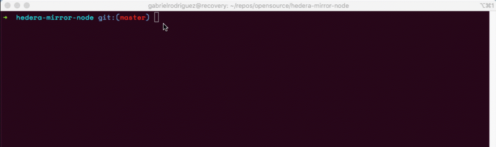

# Hedera Mirror Node Object Storage Bucket Setup

This How-to is aimed at users who wish operate a community open-sourced Hedera Mirror Node. 

## Getting Started

These instructions will guide you on retrieving record streams from a Hedera Network via which are stored in Google Cloud storage buckets.

## Prerequisites

Before getting started, you must have the following prerequisites:

* A [Google Cloud](https://cloud.google.com/) billing account [linked](https://cloud.google.com/billing/docs/how-to/manage-billing-account) to a [Project](https://cloud.google.com/resource-manager/docs/creating-managing-projects)
* [gsutil tool](https://cloud.google.com/storage/docs/gsutil)

### Authenticate and Authorize gcloud to access the Cloud Platform with your Google user credentials
Step 1)
Obtain access credentails for your user account via web-based authorization flow.

```console
gcloud auth login
```


Step 2) If you have multiple Google Cloud accounts it may be necessary to check which account is active.
```console
gcloud auth list
```
Step 3) Set the correct one, make sure to replace `ACCOUNT`.
```console
gcloud config set account `ACCOUNT`
```


Step 4) Set your Project ID
```console
gcloud config set project PROJECT_ID
```

For further information on gcloud auth, visit the [official documentation](https://cloud.google.com/sdk/gcloud/reference/auth/login).

### Accessing an object in the Hedera Object Storage Requestor Pays Bucket

Hedera's Google Storage Bucket is configured for [requester pays](https://cloud.google.com/storage/docs/requester-pays). 
Meaning that that mirror node operators will assume and accept the operational costs of reading and retrieving data records from the Hedera Network of your choice, either MainNet or TestNet.

You must ensure billing is defined and configured to your Project. For further instructions see the [Cloud Billing Documentation](https://cloud.google.com/storage/docs/using-requester-pays#gsutil_3).


| Name                      | Default Value                     | Description                                 |
|---------------------------|---------------------------------  |---------------------------------------------|
| [YOUR_PROJECT_ID]         |                                   | Your Google Cloud Project Unique Identifier |
| [HEDERA_BUCKET_NAME]      | `hedera-mainnet-streams`          | Hedera's Google Cloud Storage Bucket Name   |
| [YOUR_OBJECT_DESTINATION] | `/var/lib/hedera-mirror-importer` | Location on where to store the file         |

Replace the text in **[Brackets]** with your Google Cloud Storage Account

Let's go ahead and check what's in the Storage Bucket
```consile
gsutil -u [YOUR_PROJECT_ID] ls gs://hedera-mainnet-streams
```

Example for **mainnet**:

```console
gsutil -u [YOUR_PROJECT_ID] cp gs://hedera-mainnet-streams /var/lib/hedera-mirror-importer
```

For a complete list and how-to guide on [working with buckets](https://cloud.google.com/storage/docs/how-to#working-with-buckets) and [working with objects](https://cloud.google.com/storage/docs/how-to#working-with-objects)


## Contributing
Pull requests are welcome. For major changes, please open an issue first to discuss what you would like to change.

Please make sure to update tests as appropriate.