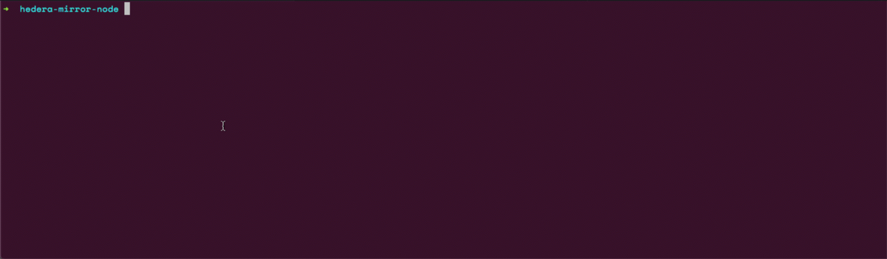

hedera-gcs-setup
=========

This repository is an Ansible role to quickly stand up an open-source Hedera Mirror Node. 
> Note: This how-to tutorial meant to quickly get started and not to be used as an official representation by Hedera on what platform architecture must be used.


Requirements
------------

Before getting started, you must have the following prerequisites:

* A [Google Cloud](https://cloud.google.com/) billing account [linked](https://cloud.google.com/billing/docs/how-to/manage-billing-account) to a [Project](https://cloud.google.com/resource-manager/docs/creating-managing-projects)

> Note: In order to operate a Hedera Node, you must configure a billing account, because the object storage bucket you will need to pull streams from is configured for  [requester pays](https://cloud.google.com/storage/docs/requester-pays). 
Meaning that mirror node operators will assume and accept the operational costs of reading and retrieving data records from the Hedera Network of your choice, either MainNet or TestNet.

<!-- * [gsutil](https://cloud.google.com/storage/docs/gsutil) -->

* [Ansible 2.9](https://docs.ansible.com/ansible/latest/installation_guide/intro_installation.html)

* An [Ubuntu 18.04 LTS](https://releases.ubuntu.com/18.04.4/) Linux Server with 2 CPU, 4GB Memory, 100 GB Storage
> This is where we will install and operate a Hedera-Mirror-Node

Getting Started
---------------

These instructions will guide you on retrieving record streams from a Hedera Network via which are stored in Google Cloud storage buckets. Don't worry about perform a git clone from here, we'll handle that with some automation.


### Create our Project Directory and working files
From your local machine let's create a project directory with some files
that will look like this.

**Step 1)** 
```console
mkdir hedera-mirror-node
```
**Step 2)**

Let's create the subdirectories
```console
mkdir hedera-mirror-node/vars 
```
```console
mkdir hedera-mirror-node/roles
```

**Step 3)**
Using a text editor of your choice create an inventory file that looks something like this

`hedera-mirror-node/inventory.ini`
```ini
[mirrornode]
IPADDRESS ansible_ssh_user=USERNAME
```
> Note: replace IP Address with the IP address of your ubuntu server and the USERNAME with your host username, usually it's ubuntu.

**Step 4)**
We'll create a requirements folder to tell ansible where to download this Ansible role

`hedera-mirror-node/roles/requirements.yml`
```yml
---
# from github
- src: https://github.com/injectedfusion/hedera-gcs-setup
...
```

**Step 5)**
Navigate inside our project directory and launch the ansible requirements
```console
cd hedera-mirror-node
```

Authenticate and Authorize gcloud to access the object storage bucket with your Google account credentials
----------------------------------------------------------------------------------------------------------

Will need to generate credentials to call the Google Cloud Storage JSON API from our Hedera Node

**(Step 1)** Generate a HMAC Key
Use the [Google Documentation Guide](https://cloud.google.com/storage/docs/authentication/managing-hmackeys) for this step


**(Step 2)** Using a code editor of your choice create file named `project-id.json` copy your HMAC access key and secret key from the previous step.




<!-- Role Variables
--------------

A description of the settable variables for this role should go here, including any variables that are in defaults/main.yml, vars/main.yml, and any variables that can/should be set via parameters to the role. Any variables that are read from other roles and/or the global scope (ie. hostvars, group vars, etc.) should be mentioned here as well. -->


Example Playbook
----------------

`server_build.yml`
```yaml
---
- hosts: mirrornode
  vars_files:
    - project-id.json
  roles:
    - hedera-gcs-setup
...
```

Your project directory should now look something like this
```console
.
├── vars
│   └── project-id.json
├── inventory.ini
├── roles
│   └── requirements.yml
└── server_build.yml
```

Build & Execute our Playbook
--------------------

**Step 1)** Using your code editor of choice, create a file `server_build.yml` with the contents of our [example playbook](https://github.com/injectedfusion/hedera-gcs-setup#example-playbook) in the top level of your directory. 


**Step 2)** Let's install the necessary ansible role
```console
ansible-galaxy install -r roles/requirements.yml --force
```


**Step 3)** Now we are good to run our playbook which will build & deploy our MirrorNode
```console
ansible-playbook -i inventory.ini server_build.yml --tags "install, start_services"
```

**Step 4)** If your wish to stop the mirror node services
```console
ansible-playbook -i inventory.ini server_build.yml --tags "stop_services"
```


License
-------

MIT

## Contributing
Pull requests are welcome. For major changes, please open an issue first to discuss what you would like to change.

Please make sure to update tests as appropriate.


Author Information
------------------

Gabriel Rodriguez

